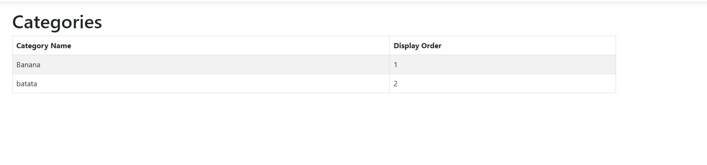

# Book Store Sample Project


- During my DevOps endeavors I found the necessity to deepen my understanding of the development of fullstack applications, so I'll start studying some .NET stuff, since most applications I have to manage in my day job are made using it.
- To help me quickstart some projects I'm following [this 3 hour tutorial from FreeCodeCamp](https://www.youtube.com/watch?v=hZ1DASYd9rk&ab_channel=freeCodeCamp.org), but this is only the first one.
- This is more of a learning-centring project, so I won't document stuff as heavily, but I'll keep writing my notes from the tutorial below:

---

## Tutorial Notes
**Link to tutorial: ** https://www.youtube.com/watch?v=hZ1DASYd9rk&ab_channel=freeCodeCamp.org

- Dependency injection happens after the builder object is declared and before its `build()` function is called:

```csharp
var builder = WebApplication.CreateBuilder(args); // Builder is created

// Dependency injection happens here
builder.Services.AddControllersWithViews(); 

var app = builder.Build(); //Builder is built
```

- In the code above the services are being added to a *container*, which in this instance is a Dependency Injection Container, not a Docker one
- In the `Program.cs` there is also the concept of an **application pipeline**, not the CI/CD kind, it refers to how the application will behave after receiving a web request;
  - The order things happen in this pipeline is important
  - The pipeline for this template is as below:

```csharp
app.UseHttpsRedirection();
app.UseStaticFiles();

app.UseRouting();

app.UseAuthorization();

app.MapControllerRoute(
    name: "default",
    pattern: "{controller=Home}/{action=Index}/{id?}");

app.Run();
```

### MVC Briefing

- **Model:** Represents the data the application will work with.
  - Heuristic: Each table in a database can be its own class, which will be a model class. The attributes for that class will be the table's columns
- **View:** The thing a user sees, used to represent the data in the final application
  - The view layer can be thought as the HTML for the application but it's not only limited to that
  - Cannot interact directly with the model
- **Controller:** Is called by the view to interact with the model, since they can't communicate directly
  - Process business logic
  - Handle requests
  - Most of the actual application code

**A typical scenario**
1. User clicks on a button, request is received by the controller
2. Controller fetches the model to know what the data is
3. Using the data it fetched, the controller calls the view to see how the data will be presented
4. The controller returns the presentation to the user

### Routing
- For MVC, URLs will most likely follow the structure:

```
https://localhost:55555/{controller}/{action}/{id}
```

---

- Controller class names should always end with `Controller` for the framework to recognize it as an actual controller class.
- In the `Views` folder, each controller has its own subfolder related to the views associated with it.
- The controller class has some methods like these:
```csharp
    public IActionResult Index()
    {
        return View();
    }
    public IActionResult Privacy()
    {
        return View();
    }
```
The `View()` being return is different in each method. The view for `Index` for example is the HTML file in the path `Views/Home/Index.cshtml`

- There is also a `Views/Shared` folder which has partial views
  - The `_Layout.cshtml` is even more special because it is the default master page of the application. Can be thought as the `index.html` for the application
    - This file is the master page because it is referenced in the `_ViewStart.cshtml` file
- `_ViewImports.cshtml` is where global `using` directives will be placed

### Tag Helpers
- ASP.NET's way of dinamically generating HTML.
- Looks like this:

```html
<label class="form control" asp-for="FirstName"></label>
```

- They are very focused on keeping their syntax inside regular HTML, and things are defined using tags for each element (hence the TAG in Tag Helpers)

### Action Results
- Action Results are an abstraction that allow to group results to certain actions in an application under the same type
- Example: If a function can return a `View` but under some conditions can also redirect to another page (returning a `Redirect`), both `View` and `Redirect` can be thought as `IActionResult`s
- POLYMORPHISM

---

- To develop using **hot reloading**, use `dotnet watch` instead of `dotnet run`
  - I'm forcing myself to use the .NET CLI instead of Visual Studio because I don't like IDEs that bring too much abstraction when I'm learning

### Creating Model Classes
- Since usually a model class corresponds to a table, we can use annotations to determine the table's behavior in the code as well:
```csharp
using System.ComponentModel.DataAnnotations;

    [Key]
    public int Id { get; set; }
```
- This marks the attribute as a primary key
- Other annotations
  - `[Required]`

- Apparently there is a difference between MVC applications and Razor applications, look into it later

---

- Add new dependencies to a project using `dotnet add package <package_name>`
  - Didn't figure out how to search the package name from the command line yet
- On new classes, type `ctor` for intellisense to create the constructor method for you
- The creation of the database objects will be handled by the Microsoft.EntityFrameworkCore packages, in this case the `ApplicationDbContext` class in the `Data` folder, which inherits from `DbContext`
  - This is the **code first** entity framework model, because I'm declaring everything in the .NET code and not creating anything in the database manually. There is also the **database first** model.

- Using the database connection string in the application:
```csharp
builder.Services.AddDbContext<ApplicationDbContext>(options => options.UseSqlServer(
    builder.Configuration.GetConnectionString("DefaultConnection")
));
```
- The `GetConnectionString` method searches in the `appsettings.json` folder for the key `DefaultConnection` in the `ConnectionStrings` object (this detail isn't obvious, but that's what's happenning)
- Also this sets up dependency injection for the ApplicationDbContext class, so it can be used in the controllers now


- To run the migrations I had to install the entity framework CLI tools, which is not obvious how to do if you're not using visual studio.
  - The command that worked for me was `dotnet tools install --global dotnet-ef`, which I took from here: https://stackoverflow.com/questions/7903711/using-nuget-package-manager-console-outside-visual-studio-to-run-entity-framewor
  - Also to add migrations the command is slightly different: `dotnet ef migrations add <migration_name>`
  - To run the migrations use `dotnet ef database update`
    - This connects to the database using the connection string specified in the `appsettings.json` (not sure how authentication is working right now, though)
- Followed [this tutorial](https://www.dirceuresende.com/blog/sql-server-management-studio-ssms-como-ativar-o-tema-dark-dark-theme-support/) to enable dark mode in Sql Server Management Studio because of course I did
- Managed to access the database in my application:



- Apparently I'm using Razor pages to dinamically generate HTML based on C# stuff, see `Views/Category/Index.cshtml`
- Bootswatch is a repository of premade Bootstrap themes for applications, which is really handy and I will definitely use it in the future
- Also there is Bootstrap icons that I didn't know, but it's as easy to use as putting a new stylesheet ref in the HTML and using the correct `<i>` classes

Tutorial checkpoint: 2:06:00